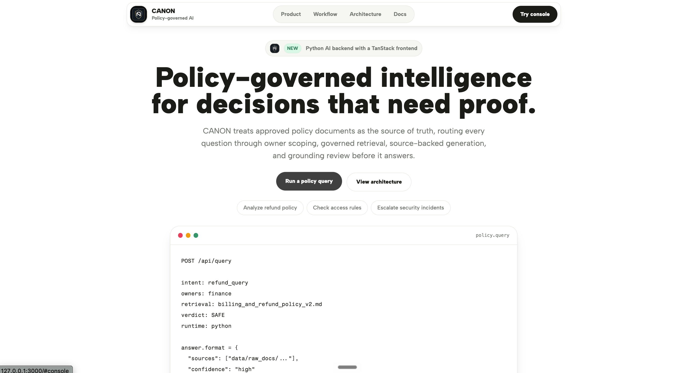
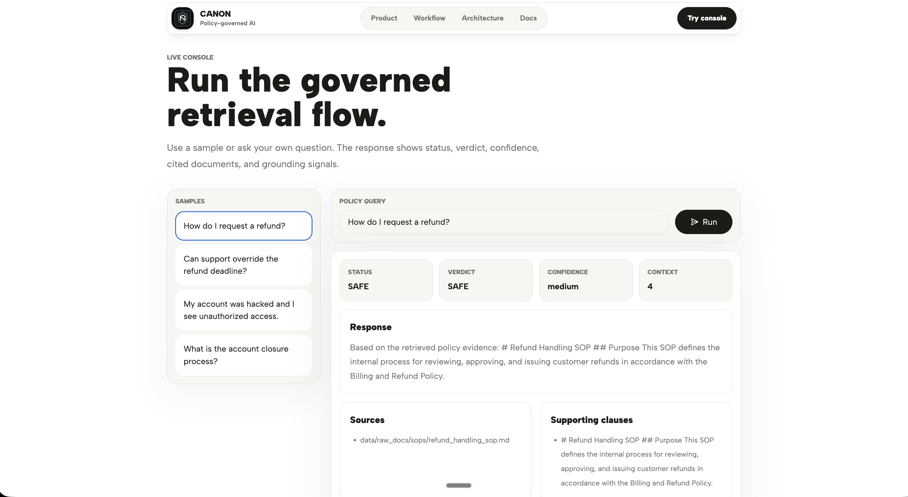
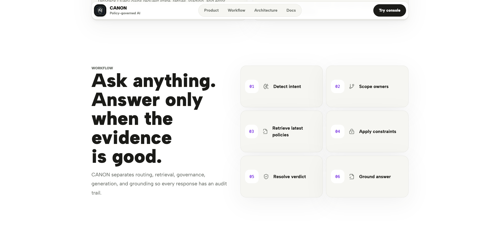

<div align="center">


# CANON

**Policy-governed intelligence for decisions that need proof.**

***Take organizational rules, retrieve the authoritative version, enforce constraints, and only then let AI answer.***

[](https://react.dev/)
[](https://www.typescriptlang.org/)
[](https://tanstack.com/)
[](https://vite.dev/)
[](https://tailwindcss.com/)
[](https://www.python.org/)
[](https://ai.google.dev/)
[](https://groq.com/)

[Overview](#overview) | [Demo](#demo) | [Architecture](#architecture) | [Run Locally](#run-locally) | [Deployment](#deployment)

</div>

---



## Overview

CANON is a governance-gated policy intelligence system for teams that need internal policy answers with traceable evidence. It does not treat the model as the source of truth. Instead, it treats approved policy documents as the canonical authority and uses the model only after routing, retrieval, and governance checks have already narrowed the answer space.

The system is designed for organizational policy workflows where a generic chatbot would be risky: refund rules, access controls, support exceptions, security escalation, compliance-sensitive procedures, and versioned operating policies.

The current production path is a **Vite + React 19 + TanStack frontend** calling a **Python API** for policy intelligence. Groq handles classification/generation and Gemini handles embeddings from the Python layer. The previous Streamlit, FAISS, local SentenceTransformers, and Next.js TypeScript API implementations are no longer the production path.

CANON can currently answer from the included markdown policy corpus, return sources and supporting clauses, refuse invalid or policy-disallowed requests, and escalate sensitive cases. It is still a project/demo system, not a substitute for legal, compliance, or human policy approval.

## Demo



```text
Question
  -> intent detection
  -> owner routing
  -> Gemini embedding
  -> policy retrieval
  -> governance verdict
  -> source-backed answer or refusal
```

Example query:

```text
Can support override the refund deadline?
```

Example response shape:

```json
{
  "status": "SAFE",
  "verdict": "SAFE",
  "answer": "The answer is generated only from retrieved policy clauses.",
  "sources": ["data/raw_docs/policies/billing_and_refund_policy_v2.md"],
  "supporting_clauses": ["Relevant policy text used by the answer."],
  "confidence": "high",
  "context_used": 5,
  "hallucination_detected": false
}
```

## At A Glance

| Area | Current State |
| --- | --- |
| Frontend | React 19, TypeScript, TanStack Start-ready Vite app, TanStack Router, TanStack Query |
| UI | Tailwind CSS v4, Radix UI primitives, shadcn-style components, Lucide icons |
| API | Python FastAPI endpoint at `POST /api/query` |
| AI Layer | Python calls Groq chat completions and Gemini embeddings |
| Retrieval | Python retrieval over static JSON embeddings, with lexical local fallback |
| Data | Markdown policy documents under `data/raw_docs` |
| Deployment | Static frontend plus Python API service |
| Status | Portfolio-grade MVP with deterministic governance gates |

## Key Features

- **Policy-first answers:** every answer is grounded in approved internal documents.
- **Owner-scoped retrieval:** queries are routed to Finance, Operations, Security, or Support before evidence is used.
- **Version-aware evidence:** latest policy versions win over stale source documents.
- **Explicit governance verdicts:** responses are classified as `SAFE`, `REFUSE_POLICY`, `REFUSE_INVALID`, or `ESCALATE`.
- **Source-backed output:** answers include source paths, supporting clauses, confidence, and grounding status.
- **No Node AI backend:** Node is used only for frontend tooling; the intelligence runtime is Python.
- **Legacy preserved:** the Streamlit path remains available for reference and comparison.

## Workflow



## Architecture

```text
Browser
  -> Vite React UI
  -> TanStack Query mutation
  -> Python POST /api/query
  -> Python Groq intent detection
  -> deterministic owner routing
  -> Python Gemini query embedding
  -> cosine retrieval over data/search-index.json
  -> owner/latest-version constraints
  -> Python Groq governance classification
  -> Python Groq answer or refusal generation
  -> lexical grounding check
  -> JSON response
```

The architecture is shaped around one rule: the model should not get to answer until the system has decided which policy owner applies, which documents are authoritative, whether the request is allowed, and whether the final answer stays close to the retrieved evidence.

Read the full architecture notes in [`docs/ARCHITECTURE.md`](docs/ARCHITECTURE.md).

## Tech Stack

| Layer | Tools |
| --- | --- |
| UI | React 19, TypeScript, Tailwind CSS v4 |
| Routing | TanStack Router |
| Data Fetching | TanStack React Query |
| Components | Radix UI primitives, shadcn-style local components |
| Charts/Icons | Recharts, Lucide React |
| Build | Vite with TanStack Start package alignment |
| API | Python FastAPI |
| Classification | Python calling Groq chat completions |
| Generation | Python calling Groq chat completions |
| Embeddings | Python calling Gemini Embedding API |
| Retrieval | Python static JSON index, cosine similarity, lexical fallback |
| Source Data | Markdown policy documents |
| Deploy | Static frontend plus Python API host |

## Why This Exists

The original version used Streamlit, FAISS, local SentenceTransformers, and a local cross-encoder reranker. That worked for a demo, but it created major hosting friction:

- Streamlit expects a persistent Python app server.
- `sentence-transformers` loads a local embedding model.
- the reranker also loads a local model.
- `faiss-cpu` is a native dependency.
- serverless platforms do not handle local model warmup cleanly.
- local JSONL logging is not durable in serverless environments.

The new version keeps the same governance idea while moving heavyweight embedding work into a build-time index and keeping all AI orchestration in Python.

## Run Locally

Clone the repository:

```bash
git clone https://github.com/ayushcodes13/Internal-Policy-Intelligence-System.git
cd Internal-Policy-Intelligence-System
```

Install dependencies:

```bash
pnpm install
python3 -m venv .venv
source .venv/bin/activate
pip install -r requirements.txt
```

Create a local environment file:

```bash
cp .env.example .env.local
```

Build the retrieval index:

```bash
pnpm run build:index
```

Start the Python API:

```bash
pnpm run dev:api
```

Start the frontend in another terminal:

```bash
pnpm run dev
```

Then open the local Vite URL printed by the dev server.

## Environment Variables

```makefile
GROQ_API_KEY=
GEMINI_API_KEY=
GROQ_MODEL=llama-3.3-70b-versatile
GEMINI_EMBEDDING_MODEL=gemini-embedding-001
VITE_API_BASE_URL=
```

Never commit real secrets. Keep `.env.local` untracked and configure production secrets directly in the hosting provider.

## Project Structure

```text
frontend/
  index.html
  src/
    components/ui/
    lib/
    screens/
    sections/
    main.tsx
    router.tsx
    styles.css

api/
  main.py
  pipeline.py
  build_search_index.py

data/
  raw_docs/
  search-index.json

docs/
  ARCHITECTURE.md
  DOMAINS.md
  assets/
```

## Engineering Decisions

- **Use the requested frontend stack:** React 19, TypeScript, TanStack Router, TanStack Query, Vite, Tailwind v4, Radix-style UI, Lucide icons, and Recharts now own the browser app.
- **Keep AI in Python:** intent detection, retrieval, governance, generation, and grounding are all behind `api/main.py`.
- **Use hosted embeddings:** Gemini embeddings replace local SentenceTransformers for the production index path.
- **Keep retrieval simple:** the document set is small, so a static JSON vector index is easier to deploy than FAISS.
- **Gate before generation:** governance classification happens before answer generation, not after.
- **Expose uncertainty:** confidence, grounding warnings, context count, and sources are part of the response contract.
- **Preserve legacy code:** the Streamlit implementation stays in the repo as a reference for the earlier workflow.

## Limitations

- The best results require valid Groq and Gemini API keys.
- Without keys, the Python API uses deterministic local fallback logic for development only.
- The current index is generated from local markdown files, not a live document management system.
- There is no authentication or role-based access control yet.
- The grounding check is lexical and lightweight, not a formal proof system.
- It is a portfolio-grade MVP and still needs security review before real organizational use.

## Roadmap

- Add a persistent document ingestion dashboard.
- Add authentication and role-aware policy access.
- Add policy owner approval workflows.
- Add richer evaluation tests for refusals, escalations, and grounding.
- Add durable production logging for audit trails.
- Deploy a public static frontend and Python API demo.
- Add a clean free subdomain such as `canon-policy.pages.dev` or `canon.is-a.dev`.

## Screenshots


## Deployment

Build the static frontend:

```bash
pnpm run build
```

Build the optional embedding index:

```bash
pnpm run build:index
```

Run the Python API wherever Python services are hosted:

```bash
python3 -m uvicorn api.main:app --host 0.0.0.0 --port 8000
```

Set `VITE_API_BASE_URL` when the frontend and Python API are deployed on different origins.

## License

This project is released under the Apache License 2.0. See [`LICENSE`](LICENSE).
