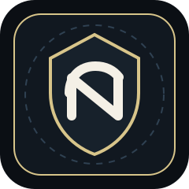
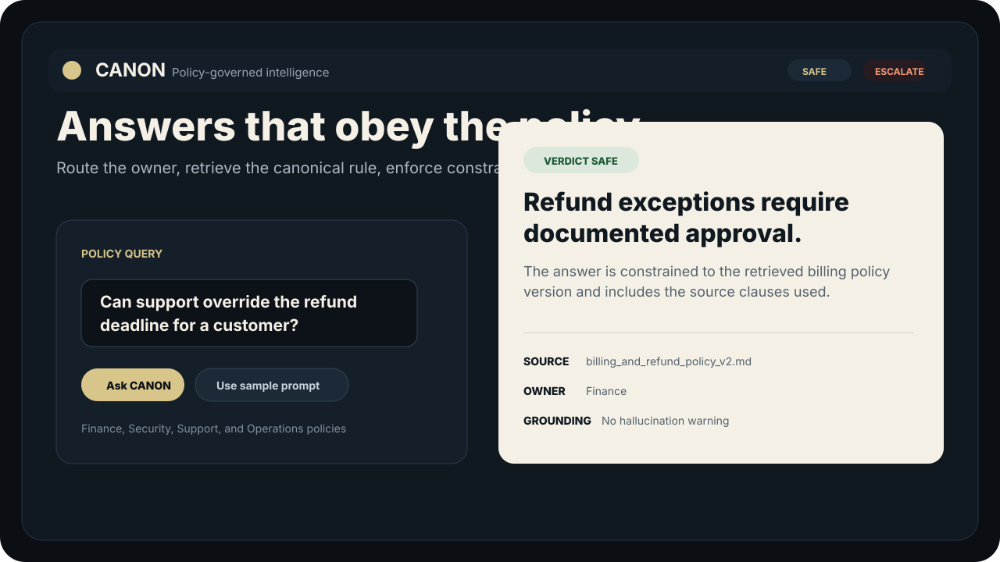
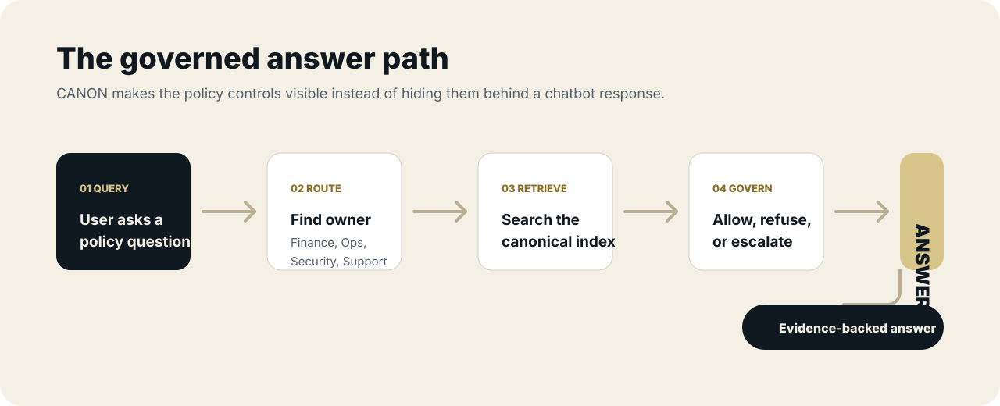
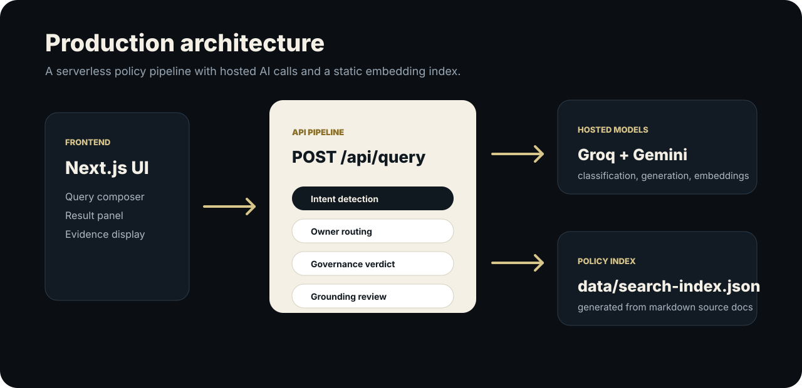

<div align="center">



# CANON

**Policy-governed intelligence for decisions that need proof.**

***Take organizational rules, retrieve the authoritative version, enforce constraints, and only then let AI answer.***

[](https://nextjs.org/)
[](https://www.typescriptlang.org/)
[](https://ai.google.dev/)
[](https://groq.com/)
[](https://vercel.com/)
[](https://workers.cloudflare.com/)

[Overview](#overview) | [Demo](#demo) | [Architecture](#architecture) | [Run Locally](#run-locally) | [Deployment](#deployment)

</div>

---



## Overview

CANON is a governance-gated policy intelligence system for teams that need internal policy answers with traceable evidence. It does not treat the model as the source of truth. Instead, it treats approved policy documents as the canonical authority and uses the model only after routing, retrieval, and governance checks have already narrowed the answer space.

The system is designed for organizational policy workflows where a generic chatbot would be risky: refund rules, access controls, support exceptions, security escalation, compliance-sensitive procedures, and versioned operating policies.

The current production app is a **Vercel-ready Next.js application** backed by Groq for classification/generation and Gemini for embeddings. The previous Streamlit, FAISS, and local SentenceTransformers implementation is preserved as a legacy reference path, but it is no longer the production frontend.

CANON can currently answer from the included markdown policy corpus, return sources and supporting clauses, refuse invalid or policy-disallowed requests, and escalate sensitive cases. It is still a project/demo system, not a substitute for legal, compliance, or human policy approval.

## Demo



```text
Question
  -> intent detection
  -> owner routing
  -> Gemini embedding
  -> policy retrieval
  -> governance verdict
  -> source-backed answer or refusal
```

Example query:

```text
Can support override the refund deadline?
```

Example response shape:

```json
{
  "status": "SAFE",
  "verdict": "SAFE",
  "answer": "The answer is generated only from retrieved policy clauses.",
  "sources": ["data/raw_docs/policies/billing_and_refund_policy_v2.md"],
  "supporting_clauses": ["Relevant policy text used by the answer."],
  "confidence": "high",
  "context_used": 5,
  "hallucination_detected": false
}
```

## At A Glance

| Area | Current State |
| --- | --- |
| Frontend | Next.js App Router, React, TypeScript |
| API | Next.js route handler at `POST /api/query` |
| AI Layer | Groq chat completions and Gemini embeddings |
| Retrieval | Static JSON embedding index with cosine similarity |
| Data | Markdown policy documents under `data/raw_docs` |
| Deployment | Vercel-ready, Cloudflare Workers compatible through OpenNext |
| Status | Portfolio-grade MVP with deterministic governance gates |

## Key Features

- **Policy-first answers:** every answer is grounded in approved internal documents.
- **Owner-scoped retrieval:** queries are routed to Finance, Operations, Security, or Support before evidence is used.
- **Version-aware evidence:** latest policy versions win over stale source documents.
- **Explicit governance verdicts:** responses are classified as `SAFE`, `REFUSE_POLICY`, `REFUSE_INVALID`, or `ESCALATE`.
- **Source-backed output:** answers include source paths, supporting clauses, confidence, and grounding status.
- **Serverless-friendly design:** no local transformer model downloads during request runtime.
- **Legacy preserved:** the Streamlit/Python path remains available for reference and comparison.

## Architecture



```text
Browser
  -> Next.js UI
  -> POST /api/query
  -> Groq intent detection
  -> deterministic owner routing
  -> Gemini query embedding
  -> cosine retrieval over data/search-index.json
  -> owner/latest-version constraints
  -> Groq governance classification
  -> Groq answer or refusal generation
  -> lexical grounding check
  -> JSON response
```

The architecture is shaped around one rule: the model should not get to answer until the system has decided which policy owner applies, which documents are authoritative, whether the request is allowed, and whether the final answer stays close to the retrieved evidence.

Read the full architecture notes in [`docs/ARCHITECTURE.md`](docs/ARCHITECTURE.md).

## Tech Stack

| Layer | Tools |
| --- | --- |
| UI | Next.js, React, TypeScript, CSS |
| API | Next.js route handlers |
| Classification | Groq chat completions |
| Generation | Groq chat completions |
| Embeddings | Gemini Embedding API |
| Retrieval | Static JSON index, cosine similarity |
| Source Data | Markdown policy documents |
| Deploy | Vercel, Cloudflare Workers through OpenNext |

## Why This Exists

The original version used Streamlit, FAISS, local SentenceTransformers, and a local cross-encoder reranker. That worked for a demo, but it created major hosting friction:

- Streamlit expects a persistent Python app server.
- `sentence-transformers` loads a local embedding model.
- the reranker also loads a local model.
- `faiss-cpu` is a native dependency.
- serverless platforms do not handle local model warmup cleanly.
- local JSONL logging is not durable in serverless environments.

The new version keeps the same governance idea while moving heavyweight embedding work into a build-time index and using hosted model APIs at runtime.

## Run Locally

Clone the repository:

```bash
git clone https://github.com/ayushcodes13/Internal-Policy-Intelligence-System.git
cd Internal-Policy-Intelligence-System
```

Install dependencies:

```bash
pnpm install
```

Create a local environment file:

```bash
cp .env.example .env.local
```

Build the retrieval index:

```bash
pnpm run build:index
```

Start the app:

```bash
pnpm run dev
```

Then open the local URL printed by Next.js.

## Environment Variables

```makefile
GROQ_API_KEY=
GEMINI_API_KEY=
GROQ_MODEL=llama-3.3-70b-versatile
GEMINI_EMBEDDING_MODEL=gemini-embedding-001
```

Never commit real secrets. Keep `.env.local` untracked and configure production secrets directly in the hosting provider.

## Project Structure

```text
app/
  api/query/route.ts
  layout.tsx
  page.tsx
  globals.css

components/
  hero-section.tsx
  product-sections.tsx
  query-composer.tsx
  result-panel.tsx
  site-header.tsx
  status-metrics.tsx

config/
  product.ts

lib/
  client/query-client.ts
  gemini.ts
  groq.ts
  pipeline.ts
  retrieval.ts
  types.ts

scripts/
  build-search-index.mjs

data/
  raw_docs/
  search-index.json

docs/
  ARCHITECTURE.md
  DOMAINS.md
  assets/
```

## Engineering Decisions

- **Use hosted embeddings:** Gemini embeddings replace local SentenceTransformers so the app can run on serverless infrastructure.
- **Keep retrieval simple:** the document set is small, so a static JSON vector index is easier to deploy than FAISS.
- **Gate before generation:** governance classification happens before answer generation, not after.
- **Expose uncertainty:** confidence, grounding warnings, context count, and sources are part of the response contract.
- **Preserve legacy code:** the Streamlit implementation stays in the repo as a reference for the earlier workflow.

## Limitations

- The app requires valid Groq and Gemini API keys.
- The current index is generated from local markdown files, not a live document management system.
- There is no authentication or role-based access control yet.
- The grounding check is lexical and lightweight, not a formal proof system.
- It is a portfolio-grade MVP and still needs security review before real organizational use.

## Roadmap

- Add a persistent document ingestion dashboard.
- Add authentication and role-aware policy access.
- Add policy owner approval workflows.
- Add richer evaluation tests for refusals, escalations, and grounding.
- Add durable production logging for audit trails.
- Deploy a public demo on Vercel or Cloudflare Workers.
- Add a clean free subdomain such as `canon-policy.pages.dev` or `canon-policy.<account>.workers.dev`.

## Screenshots


## Deployment

### Vercel

Make sure the retrieval index exists:

```bash
pnpm run build:index
```

Set these environment variables in Vercel:

```bash
GROQ_API_KEY
GEMINI_API_KEY
GROQ_MODEL
GEMINI_EMBEDDING_MODEL
```

Deploy:

```bash
vercel deploy
```

### Cloudflare Workers

The repo includes OpenNext and Wrangler configuration:

```bash
pnpm run cf:build
pnpm run cf:preview
pnpm run cf:deploy
```

Recommended free hostname:

```text
canon-policy.<your-cloudflare-subdomain>.workers.dev
```

Read [`docs/DOMAINS.md`](docs/DOMAINS.md) for the free domain plan.

## License

This project is released under the Apache License 2.0. See [`LICENSE`](LICENSE).
